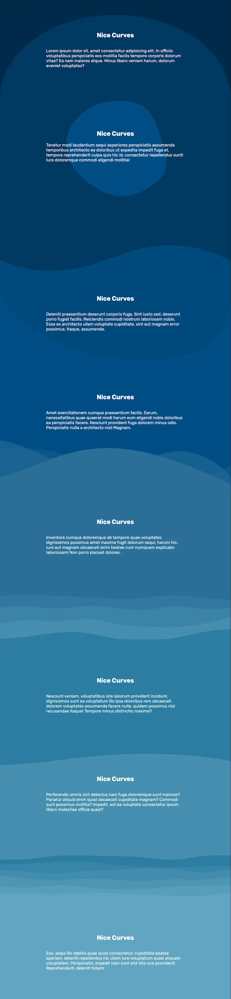

# CURVY-BACKGROUNDS
CSS and SVG exercise website created based on the tutorial by Fireship.io.

## Usage
Access the [Live link](https://leandromichelena.github.io/Curvy-backgrounds/). 
Or clone this repository (git clone git@github.com:leandromichelena/Curvy-backgrounds.git) and open the HTML file in your browser.  
Feel free to experiment with the color palette and shapes of the curves.

## Overview

## Built With
* HTML
* CSS
* javascript
* SVG
* Kute.js

## Support
If you find any bugs or have any questions, please contact me on Github.

## Authors and Acknowledgment
HTML, CSS, and javascript created by Leandro Michelena. 
Project idea by [Jeff Delaney](https://github.com/codediodeio). 
Wavy backgrounds with CSS and SVG by [Fireship.io](https://fireship.io/lessons/wavy-backgrounds/). 
SVG Shapes by [Shape Divider App](https://www.shapedivider.app/) and [Haikei.app](https://haikei.app/). 
SVG morph animation with [Kute.js](https://thednp.github.io/kute.js/index.html)

## License
MIT License